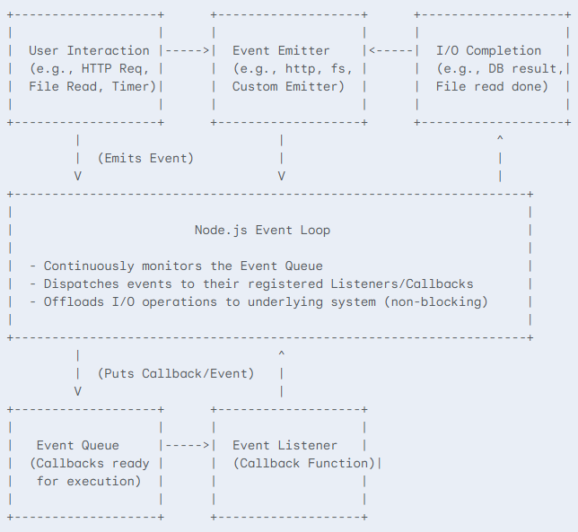

# What is Node js
Node.js is a runtime environment that allows developers to execute JavaScript code outside of a web browser. It is built on the V8 JavaScript engine, the same engine that powers Google Chrome, enabling high performance. Node.js is open-source, cross-platform, and designed for building scalable network applications. It excels in handling concurrent operations efficiently through its non-blocking, event-driven architecture. 

Node.js operates on a single thread, utilizing an event loop to manage multiple tasks concurrently. This approach allows it to handle numerous connections with minimal overhead, making it suitable for real-time applications and I/O-intensive tasks. It is commonly used for server-side development, creating APIs, and building command-line tools.

### Node JS Pros
- Single-threaded, based on event drive, non blocking I/O model
- Perefect for building fast and scalable data-intensive apps.

### Use Node JS
- Api with Database behind it
- Data stream (think Youtube)
- Real time chat application
- server side web application

### Don't Use Node JS
- Applciations with heavy server side processing. Node.js is single-threaded by default and designed for I/O-bound operations. Heavy CPU tasks (e.g., image/video processing, data crunching, or complex algorithms) can block the event loop and degrade performance.
- Applications with Blocking Code or Heavy Threading Needs. If your application relies on synchronous operations or needs multi-threading (e.g., scientific computing, batch jobs), Node.js isn’t ideal out of the box.
- While Node.js supports SQL databases, it's more naturally suited for NoSQL and event-driven systems. Handling complex SQL queries and transactions isn't Node’s strength.

## What is Node JS REPL?
The Node.js REPL (Read-Eval-Print Loop) is an interactive shell that allows the execution of JavaScript code within a Node.js environment. It is a tool for testing, debugging, and experimenting with JavaScript code. When the node command is executed without any arguments, it initiates a REPL session, presenting a prompt where JavaScript code can be entered. The REPL then reads the input, evaluates it, prints the result, and loops back to await further input. This cycle continues until the user exits the session, typically by pressing.

Enter node in terminal and you can start using it.

Special commands available in the REPL include: 
- .help: Displays a list of available commands.
- .break: Cancels the current multi-line expression.
- .clear: Resets the REPL context and clears multi-line input.
- .exit: Closes the I/O stream and exits the REPL.
- .save: Saves the current REPL session to a file.
- .load: Loads a file into the current REPL session.

## What is Module in Node JS?

In Node.js, a module is a self-contained unit of code that encapsulates related functions, classes, or data. Modules enable developers to organize code into reusable components, promoting modularity, maintainability, and code reuse. Node.js employs the CommonJS module system by default, although it also supports ECMAScript (ES) modules.

### There are three main types of modules in Node.js: 
- Built-in modules: These modules are bundled with Node.js and provide core functionalities, such as file system operations (fs), HTTP requests (http), and path manipulation (path).

- Local modules: These are custom modules created by developers within their applications. They allow for the organization of application-specific logic into separate files.

- Third-party modules: These modules are external packages installed using npm (Node Package Manager). They provide a wide range of functionalities and can be easily integrated into Node.js applications.

Example of using the local module in another file (app.js):
const myModule = require('./myModule');
const fs = require('fs');

## What does fs module do in Node JS?

The fs module in Node.js provides an API for interacting with the file system. It enables operations such as reading, writing, creating, updating, deleting, and renaming files and directories. The module offers both synchronous and asynchronous methods for these operations. Asynchronous methods are non-blocking, allowing the application to continue executing other tasks while file operations are in progress. Synchronous methods, on the other hand, block execution until the operation is complete. [1]  
Commonly used methods include: [2]  

- fs.readFile(): Reads the content of a file. 
- fs.writeFile(): Writes data to a file, replacing the file if it exists. 
- fs.appendFile(): Appends data to a file. 
- fs.unlink(): Deletes a file. 
- fs.rename(): Renames a file. 
- fs.mkdir(): Creates a directory. 
- fs.rmdir(): Deletes a directory. 
- fs.readdir(): Reads the contents of a directory. 
- fs.stat(): Retrieves information about a file or directory, such as its size and type. 

The fs module is a core module in Node.js and does not require installation. It is imported using the require('fs') statement.

Here is how to read and write files in Node.js using the fs (file system) module:

**Reading Files:**

```javascript
const fs = require('fs');

// Asynchronous read
fs.readFile('example.txt', 'utf8', (err, data) => {
  if (err) {
    console.error("An error occurred:", err);
    return;
  }
  console.log(data);
});

// Synchronous read
try {
  const data = fs.readFileSync('example.txt', 'utf8');
  console.log(data);
} catch (err) {
  console.error("An error occurred:", err);
}
```

**Writing Files:**

```javascript
const fs = require('fs');

// Asynchronous write
const content = 'Hello, Node.js!';
fs.writeFile('example.txt', content, 'utf8', err => {
  if (err) {
    console.error("An error occurred:", err);
    return;
  }
  console.log("File written successfully");
});

// Synchronous write
try {
  fs.writeFileSync('example.txt', content, 'utf8');
  console.log("File written successfully");
} catch (err) {
  console.error("An error occurred:", err);
}
```

**Appending to Files:**

```javascript
const fs = require('fs');

// Asynchronous append
const content = '\nThis line is appended.';
fs.appendFile('example.txt', content, 'utf8', err => {
    if (err) {
        console.error("An error occurred:", err);
        return;
    }
    console.log("File appended successfully");
});

// Synchronous append
try {
    fs.appendFileSync('example.txt', content, 'utf8');
    console.log("File appended successfully");
} catch (err) {
    console.error("An error occurred:", err);
}
```
## Blocking and Non-blocking, Asynchronous nature of Node js

Node.js, designed for scalability and high performance, operates on a single-threaded, non-blocking, and asynchronous architecture. This approach allows it to handle multiple concurrent requests efficiently. 
Blocking vs. Non-blocking 

- Blocking: A blocking operation halts the execution of other code until it completes. In synchronous operations, the program executes line by line, and if one line takes a long time, it blocks the execution of subsequent lines. 
- Non-blocking: A non-blocking operation allows the program to continue executing other tasks while waiting for the operation to complete. Node.js leverages asynchronous, non-blocking I/O operations to prevent blocking the main thread. 

**Asynchronous Nature**

- Node.js is inherently asynchronous, meaning it doesn't wait for I/O operations (like reading from a file or a network request) to finish before moving on to other tasks. Instead, it uses callbacks, promises, or async/await to handle the results of these operations when they are complete. 
- This approach allows Node.js to handle many concurrent connections efficiently, making it suitable for building high-performance applications. When a long-running operation is initiated, Node.js registers a callback function and continues executing other code. Once the operation completes, the callback is executed, handling the result.

**Example:**

```javascript
const fs = require('fs');

// Non-blocking (asynchronous) file read
fs.readFile('file.txt', 'utf8', (err, data) => {
  if (err) {
    console.error("Error reading file:", err);
    return;
  }
  console.log("File content:", data);
});

console.log("This message is printed before the file content.");

// Blocking (synchronous) file read
try {
  const data = fs.readFileSync('file.txt', 'utf8');
  console.log("File content (synchronous):", data);
} catch (err) {
  console.error("Error reading file (synchronous):", err);
}

console.log("This message is printed after the synchronous file read.");
```

In the example above, the asynchronous readFile function does not block the execution of the subsequent console.log statement. The "This message is printed before the file content." line will be printed first. Once the file reading is complete, the callback function is executed, and the file content is printed. Conversely, readFileSync will block the execution until the file is read, ensuring that "This message is printed after the synchronous file read." is printed only after the file content.

### Why Node JS uses callback function?

Callbacks are fundamental to Node.js. Node.js uses an event-driven architecture, where operations that might take time, such as file system access or network requests, don't block the main thread. Instead, Node.js initiates these operations and then continues executing other code. When the operation completes, a callback function is executed to handle the result.

This approach allows Node.js to handle multiple requests concurrently, making it efficient for I/O-bound tasks. Callbacks are used extensively in Node.js APIs, ensuring that the program remains responsive even when dealing with time-consuming operations. They are a core mechanism for managing asynchronous control flow in Node.js applications.

### Node.js Event-Driven Architecture

Node.js is renowned for its non-blocking, asynchronous nature, which is primarily facilitated by its event-driven architecture. This paradigm allows Node.js applications to handle a large number of concurrent connections efficiently without creating a new thread for each connection, unlike traditional multi-threaded servers.

**Core Concepts**
At its heart, the event-driven architecture in Node.js revolves around a few key components:

- Events: These are actions or occurrences that happen in the system, such as a user clicking a button, data arriving from a network request, a file being read, or a timer expiring.

- Event Emitters: These are objects that emit named events. In Node.js, many built-in modules (like http, fs, net) are event emitters, and you can also create custom ones using the EventEmitter class. When an event occurs, the emitter "emits" it.

- Event Listeners (or Handlers): These are functions that "listen" for specific events emitted by an event emitter. When an event is emitted, all registered listeners for that event are executed.

- Event Loop: This is the underlying mechanism that continuously checks for events in the event queue and dispatches them to their respective listeners. It's a single-threaded process that manages all asynchronous operations. While the event loop itself is single-threaded, it offloads I/O operations to the operating system kernel or a thread pool, allowing Node.js to remain non-blocking.

- Non-blocking I/O: When Node.js performs an I/O operation (like reading a file or making a network request), it doesn't wait for the operation to complete. Instead, it sends the request and immediately continues processing other code. Once the I/O operation finishes, it emits an event, and a callback function (the event listener) is put into the event queue to be processed by the event loop.

**How it Works (The Flow)**
Imagine a server handling incoming web requests:

- Request Arrives: An incoming HTTP request (an "event") arrives at the Node.js server.

- Event Emission: The http module (an Event Emitter) emits a 'request' event.

- Listener Activation: The application's code has an event listener (a callback function) registered for the 'request' event. This listener is triggered.

- Asynchronous Operation (if any): Inside the listener, if there's an I/O operation (e.g., querying a database, reading a file), Node.js hands off this task to the underlying system (via libuv, which manages a thread pool for heavy lifting) and immediately returns to the event loop. It doesn't wait.

- Event Loop Continues: The event loop is now free to process other incoming requests or other events in the queue.

- I/O Completion & Callback: Once the database query or file read completes, it signals Node.js. The associated callback function (the "continuation" of the original request) is placed back into the event queue.

- Callback Execution: When the event loop is free, it picks up this callback from the queue and executes it, allowing the server to send the response back to the client.

This continuous cycle allows Node.js to handle many operations concurrently without blocking the main thread.

**Diagram of Node.js Event-Driven Architecture:**



**Explanation of the Diagram:**

- User Interaction / External Input: Represents anything that triggers an event (e.g., a new HTTP request, a user clicking a button in a client-side app that interacts with Node.js, a file operation starting).

- Event Emitter: The part of Node.js or your application that detects the occurrence of an event and "emits" it.

- Node.js Event Loop: The central orchestrator. It's constantly running, checking if there are any events to process. When it encounters an I/O operation, it hands it off and doesn't wait.

- I/O Completion: When an asynchronous operation (like a database query or file read) finishes, it signals the Node.js environment.

- Event Queue: When an I/O operation completes, its associated callback function is placed into this queue, waiting for the Event Loop to pick it up. Similarly, direct events emitted by an Event Emitter also lead to their listeners being placed here.

- Event Listener (Callback Function): The actual code that gets executed when the Event Loop processes an event from the queue.

**Benefits of Event-Driven Architecture in Node.js**
- Scalability: Can handle a large number of concurrent connections with minimal overhead, making it ideal for real-time applications, APIs, and microservices.

- Performance: Non-blocking I/O ensures that the server doesn't sit idle waiting for slow operations, maximizing CPU utilization.

- Simplicity: The asynchronous model with callbacks/promises/async-await simplifies handling concurrent operations compared to complex thread management.

- Efficiency: Uses fewer system resources (memory, CPU) per connection than traditional blocking I/O models.

In essence, Node.js's event-driven architecture is what enables it to be so efficient and performant for I/O-bound applications.

## Reading and Writing files Asynchronously

**Callback example**

Here is an example of reading from two files and writing to a third file using nested callbacks in Node.js:

```javascript
const fs = require('fs');

fs.readFile('file1.txt', 'utf8', (err, data1) => {
  if (err) return console.error("Error reading file1:", err); ;

  fs.readFile('file2.txt', 'utf8', (err, data2) => {
    if (err) return console.error("Error reading file2:", err);

    const combinedData = data1 + '\n' + data2;

    fs.writeFile('file3.txt', combinedData, err => {
      if (err) return console.error("Error reading file3:", err);
      console.log("Data from file1 and file2 written to file3 successfully.");
    });
  });
});
```
**Asyn/Await example:**

```javascript
// Import the promises API from the 'fs' module for async/await support
const fs = require('fs').promises;

/**
 * Reads data from two files, combines them, and writes the combined data to a third file.
 * This function uses async/await for a cleaner, more sequential asynchronous flow.
 */
async function processFiles() {
  let data1;
  let data2;

  try {
    // Read file1.txt asynchronously
    console.log("Attempting to read file1.txt...");
    data1 = await fs.readFile('file1.txt', 'utf8');
    console.log("Successfully read file1.txt.");

    // Read file2.txt asynchronously
    console.log("Attempting to read file2.txt...");
    data2 = await fs.readFile('file2.txt', 'utf8');
    console.log("Successfully read file2.txt.");

    // Combine the data from both files
    const combinedData = data1 + '\n' + data2;
    console.log("Combined data from file1.txt and file2.txt.");

    // Write the combined data to file3.txt asynchronously
    console.log("Attempting to write combined data to file3.txt...");
    await fs.writeFile('file3.txt', combinedData);
    console.log("Data from file1 and file2 written to file3.txt successfully.");

  } catch (err) {
    // Catch any errors that occur during file operations
    console.error("An error occurred during file processing:", err);
  }
}

// Call the async function to start the file processing
processFiles();

// To make this code runnable, you would need to create dummy files:
// 1. Create a file named 'file1.txt' in the same directory as this script.
//    Add some text to it, e.g., "Hello from file1!"
// 2. Create a file named 'file2.txt' in the same directory.
//    Add some text to it, e.g., "Greetings from file2!"
//
// After running the script:
// A new file named 'file3.txt' will be created with the combined content.
```

**In this code:**

- fs.readFile is used to read the contents of file1.txt and file2.txt asynchronously.
- In the first example, nested within the first readFile callback, the second readFile is called to ensure file1.txt is read first.
- In the second example we are using asyn and wait to avoide callback hell.
- The contents of both files are concatenated and stored in the combinedData variable.
- fs.writeFile is then used to write the combined data to file3.txt.
- Error handling is included for each file system operation to manage potential issues during file reading or writing.

## How to import files in Node JS?
There are primarily two main ways to import files (modules) in Node.js:

- CommonJS require() (the traditional method)
- ES Modules import/export (the modern standard)

### Let's break them down in detail:

**CommonJS** ***require()***

This is the original and default module system in Node.js. It's synchronous for loading modules (meaning it blocks execution until the module is loaded) but the I/O operations within the module can still be asynchronous.

Exporting: You use module.exports or exports to make values, functions, or objects available from a file.

- module.exports: Assigns a single value (object, function, class, primitive) as the export of the module.

- exports: A reference to module.exports. You can add properties to exports to expose multiple items.

Importing: You use the require() function to load a module. It returns the module.exports value of the required file.

**myModule.js (Exporting):**

```javascript
// Exporting a single function
module.exports = function add(a, b) {
  return a + b;
};

// Or exporting multiple items
// exports.add = function(a, b) { return a + b; };
// exports.subtract = function(a, b) { return a - b; };

// Or exporting an object
// module.exports = {
//   add: function(a, b) { return a + b; },
//   subtract: function(a, b) { return a - b; }
// };
```

**app.js (Importing):**

```javascript
// Importing the single function
const add = require('./myModule');
console.log(add(2, 3)); // Output: 5

// If myModule exported multiple items using exports.add/subtract
// const math = require('./myModule');
// console.log(math.add(2, 3));
// console.log(math.subtract(5, 2));

// or you can use:
// const {add, subtract} = require('./myModule');
```

**Key Characteristics of require():**

- Synchronous Loading: When require() is called, Node.js reads, executes, and caches the module before moving on.

- Dynamic Loading: You can call require() conditionally or inside functions.

- Caching: Once a module is require()d, it's cached. Subsequent require() calls for the same module will return the cached version, preventing redundant loading.

- Relative Paths: For local files, you use relative paths (e.g., ./myModule, ../utils/helper).

- Node Modules: For installed npm packages, you just use the package name (e.g., require('express'), require('fs')).

**ES Modules** ***import/export***
ES Modules (ECMAScript Modules) are the official standard for modules in JavaScript. They are designed for both browser and Node.js environments which can lead to better tooling and optimizations.

**How to enable ES Modules in Node.js:**

You have two primary ways:

- Using .mjs file extension: Name your JavaScript files with a .mjs extension (e.g., app.mjs, myModule.mjs). Node.js automatically treats .mjs files as ES Modules.

- Using "type": "module" in package.json: Add "type": "module" to your package.json file. This will make all .js files in that package (and its subdirectories) be interpreted as ES Modules by default. If you need to use CommonJS modules within such a project, you'd use the .cjs extension for those files.

**How it works:**

- Exporting: You use the export keyword.
  - Named Exports: Export multiple values by name.
  - Default Export: Export a single primary value (e.g., a function, class, or object).
- Importing: You use the import keyword.

**Examples:**

myModule.mjs (Exporting):

```javascript
// Named export
export function add(a, b) {
  return a + b;
}

// Named export
export const PI = 3.14159;

// Default export
const subtract = (a, b) => a - b;
export default subtract;
```

app.mjs (Importing):

```javascript
// Importing named exports
import { add, PI } from './myModule.mjs';
console.log(add(5, 2)); // Output: 7
console.log(PI);        // Output: 3.14159

// Importing the default export (you can name it anything you want)
import mySubtractFunction from './myModule.mjs';
console.log(mySubtractFunction(10, 4)); // Output: 6

// Importing all named exports as an object
// import * as MathUtils from './myModule.mjs';
// console.log(MathUtils.add(1, 1));
```

### Key Characteristics of import/export:

- Asynchronous Loading (Conceptual): While the import syntax itself is static, the underlying loading mechanism for ES Modules is designed to be asynchronous. This allows for parallel loading of dependencies and avoids blocking the main thread in environments like browsers. In Node.js, it's still largely handled efficiently, but the key is the static nature.

- Static Analysis: Module dependencies are resolved at parse time (before execution), which enables better tree-shaking (removing unused code) and more efficient bundling by tools.

- Strict Mode: ES Modules are always in strict mode.

### Which one to use?

- New Projects: For new Node.js projects, it's generally recommended to use ES Modules (import/export) as they are the modern standard and offer benefits like static analysis.

- Existing Projects: If you're working on an existing project that heavily uses require(), it's usually best to stick with CommonJS to avoid mixing module systems, which can sometimes lead to complications.

**What is static analysis benefits of ES modules?**

The static analysis benefit of ES Modules (ECMAScript Modules) is one of their most significant advantages over CommonJS modules (require()), especially in modern development workflows involving bundlers (like Webpack, Rollup, Parcel, Vite) and advanced IDEs.

Let's break down what static analysis is and how ES Modules enable it, leading to concrete benefits:

**What is Static Analysis?**

Static analysis refers to the process of analyzing source code without actually executing it. This means a tool (like a linter, a bundler, or an IDE) can read your code and understand its structure, dependencies, and potential issues just by looking at the text.

**How ES Modules Enable Static Analysis**

- CommonJS (require()):
  - Dynamic and Runtime: require() calls are functions that can be called conditionally, inside if statements, loops, or even generated dynamically.

  - Example: const myModule = require(someCondition ? './moduleA' : './moduleB');

  - This dynamic nature makes it impossible for a static analysis tool to definitively know which modules will be loaded without actually running the code.

- ES Modules (import/export):
  - Static and Compile-Time (or Parse-Time): import and export statements are declarative. They must always appear at the top-level of a module (not inside if statements or functions).

  - Example: import { someFunction } from './myModule.js';

  - Because import and export statements are fixed and known before the code even executes, static analysis tools can build a complete and accurate dependency graph of your entire application simply by parsing the source code.

**Benefits of Static Analysis (enabled by ES Modules):**

This ability to understand the module structure statically unlocks several powerful benefits:

- Tree Shaking (Dead Code Elimination):
  - The Most Significant Benefit: Bundlers can determine which parts of your code are actually being used (imported) and which are not.

  - If you export a function or variable from a module, but no other module imports it, a tree-shaking-aware bundler can simply remove that unused code from the final production bundle.

  - Benefit: Dramatically reduces the final bundle size, leading to faster loading times and improved application performance, especially for large applications or when using utility libraries where you might only need a few functions.

- Improved Tooling and IDE Support:
  - Smarter Autocompletion: IDEs (like VS Code, WebStorm) can accurately suggest available exports from modules as you type import statements.

  - Reliable Refactoring: When you rename an exported function or variable, your IDE can reliably find and update all corresponding import statements across your project.

  - Early Error Detection: Linters (ESLint) and static analysis tools can identify problems like:
    - importing a named export that doesn't exist in the source module (typos).

    - Unused imports (code that was imported but never used).

- More Efficient Bundling:
  - Since the dependency graph is known statically, bundlers can create more optimized output bundles. They can arrange modules efficiently, avoid redundant code, and apply various transformations with a clearer understanding of the code's structure.

  - Benefit: Smaller, faster, and more performant application bundles.

- Optimized Code Splitting:
  - Bundlers can use the static dependency graph to intelligently split your application's code into smaller "chunks" that can be loaded on demand (e.g., when a user navigates to a specific route).

  - Benefit: Improves initial load times by only loading the code necessary for the current view, fetching other parts asynchronously as needed.

In summary, the static nature of ES Module import/export statements transforms module management from a runtime concern into a compile-time optimization opportunity. This fundamental shift empowers modern JavaScript tooling to build smaller, faster, and more robust applications.

## How to create a webserver?

Creating a server in Node.js is a fundamental skill for building web applications and APIs. Node.js comes with a built-in http module that allows you to do this directly. For more complex applications, frameworks like Express.js are commonly used to simplify server creation and management.

Let's explore both methods:

### 1. Creating a Basic HTTP Server using the Built-in http Module

This is the most direct way to create a server in Node.js. To understanding the low-level mechanics.

- Require the ***http*** module: This module provides the functionality to create an HTTP server.

- Create a server instance: Use ***http.createServer()*** to create the server. This function takes a callback function as an argument, which will be executed every time a request is made to the server.
  - The callback function receives two arguments: ***req*** (the request object) and ***res*** (the response object).

- Listen for incoming connections: Use ***server.listen()*** to start the server and make it listen for requests on a specific port and optionally an IP address.

**Code Example (server.js):**

```javascript
// 1. Require the built-in 'http' module
const http = require('http');

// Define the port the server will listen on
const PORT = 3000;
const HOST = '127.0.0.1'; // Loopback address, means it's only accessible from your machine

// 2. Create a server instance
// The callback function is executed for every incoming request
const server = http.createServer((req, res) => {
  // 3. Handle incoming requests
  console.log(`Request received for: ${req.url} with method: ${req.method}`);

  // Set the HTTP header for a successful response (Status 200 OK, Content-Type as plain text)
  res.writeHead(200, { 'Content-Type': 'text/plain' });

  // Send the response body
  if (req.url === '/') {
    res.end('Hello from the Node.js HTTP Server!\n');
  } else if (req.url === '/about') {
    res.end('This is the About Page.\n');
  } else {
    res.writeHead(404, { 'Content-Type': 'text/plain' });
    res.end('404 Not Found\n');
  }
});

// 4. Listen for incoming connections
server.listen(PORT, HOST, () => {
  console.log(`Server running at http://${HOST}:${PORT}/`);
  console.log('Open your browser and go to:');
  console.log(`- http://${HOST}:${PORT}/`);
  console.log(`- http://${HOST}:${PORT}/about`);
  console.log(`- http://${HOST}:${PORT}/some-other-path`);
});

// Optional: Handle server errors (e.g., port already in use)
server.on('error', (error) => {
  if (error.code === 'EADDRINUSE') {
    console.error(`Port ${PORT} is already in use.`);
  } else {
    console.error('Server error:', error.message);
  }
});
```

**How to Run It:**

- Save the code above as server.js (or any other .js filename).
Open your terminal or command prompt.
- Navigate to the directory where you saved server.js.
- Run the server using Node.js:

```bash
node server.js
```

**Testing It:**

- Open your web browser and go to http://127.0.0.1:3000/. You should see "Hello from the Node.js HTTP Server!".
- Go to http://127.0.0.1:3000/about. You should see "This is the About Page."
- Go to any other path, like http://127.0.0.1:3000/test. You should see "404 Not Found".

### Creating a Server using Express.js (Recommended for Real-World Apps)

While the http module is powerful, handling routing, middleware, body parsing, and other common web tasks directly with it can become cumbersome for larger applications. This is where web frameworks like Express.js come in. Express is a minimalist, fast, and unopinionated web framework for Node.js.

- Initialize a Node.js project:

```bash
mkdir my-express-app
cd my-express-app
npm init -y
```

- Install Express:

```bash
npm install express
```

- Define routes: Express makes routing (handling different URLs and HTTP methods) much easier using methods like app.get(), app.post(), etc.

**Code Example (app.js in your my-express-app directory):**

```javascript
// 1. Require the Express framework
const express = require('express');

// Define the port
const PORT = 3000;

// 2. Create an Express application instance
const app = express();

// Middleware: Express comes with built-in middleware.
// app.use(express.json()); // For parsing JSON request bodies
// app.use(express.urlencoded({ extended: true })); // For parsing URL-encoded request bodies

// 3. Define routes (HTTP GET requests)
// Home page route
app.get('/', (req, res) => {
  res.send('<h1>Hello from Express!</h1><p>This is the home page.</p>');
});

// About page route
app.get('/about', (req, res) => {
  res.send('<h2>About Us</h2><p>We are learning Node.js and Express!</p>');
});

// Route with a URL parameter
app.get('/users/:name', (req, res) => {
  const userName = req.params.name;
  res.send(`Hello, ${userName}! Welcome to your profile.`);
});

// Catch-all for undefined routes (404 Not Found) - MUST be last
app.use((req, res) => {
  res.status(404).send('<h1>404 Not Found</h1><p>The page you requested does not exist.</p>');
});

// 4. Start the server and listen for connections
app.listen(PORT, () => {
  console.log(`Express server running on http://localhost:${PORT}`);
  console.log('Open your browser and go to:');
  console.log(`- http://localhost:${PORT}/`);
  console.log(`- http://localhost:${PORT}/about`);
  console.log(`- http://localhost:${PORT}/users/Alice`);
});
```

**How to Run It:**

- Open your terminal
- Run the server by running below command:
```bash
node app.js
```
- You should see the putput indicating the server is running.

**Testing it**

- Open your web browser and go to http://localhost:3000/.
- Go to http://localhost:3000/about.
- Go to http://localhost:3000/users/Bob.

**Key Differences & Why Express is Preferred:**

- **Routing**: Express provides clear, concise methods (***app.get***, ***app.post***, etc.) for handling different HTTP methods and URL patterns, including parameters. The raw ***http*** module requires manual parsing of ***req.url***.
- **Middleware**: Express has a robust middleware system, allowing you to easily add functionalities like body parsing (***express.json()***), logging, authentication, compression, etc., for all or specific routes. The ***http*** module requires you to implement these manually in your ***createServer*** callback.
- **Error Handling**: Express offers more streamlined error handling mechanisms.
- **Community & Ecosystem**: Express has a vast community and a rich ecosystem of third-party middleware and tools.

For most real-world web applications, using a framework like Express.js is highly recommended because it abstracts away much of the repetitive boilerplate code and provides a structured way to build robust applications.

## What is Routing?
